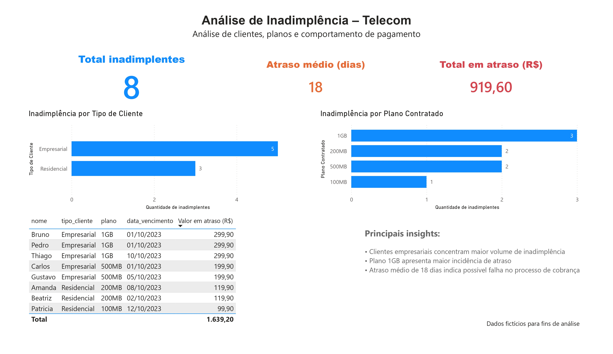

# 📊 Projeto de Análise de Inadimplência - Telecom

## 📌 Objetivo
Analisar padrões de inadimplência em clientes de uma empresa de telecom, identificando riscos, comportamento por tipo de cliente e impacto financeiro.

---

## 🧱 Estrutura dos Dados
- clientes
- contratos
- pagamentos

---

## 🛠️ Tecnologias utilizadas
- SQL Server
- Power BI
- Excel

---

## 📊 Principais análises

### 🔹 Clientes inadimplentes
Identificação de clientes com atraso superior a 10 dias ou sem pagamento.

### 🔹 Inadimplência por tipo de cliente
Comparação entre clientes residenciais e empresariais.

### 🔹 Inadimplência por plano
Identificação dos planos com maior risco.

### 🔹 Atraso médio
Medição do tempo médio de atraso nos pagamentos.

---

## 📈 Dashboard

---

## 💡 Insights

- Clientes empresariais apresentam maior volume de inadimplência
- Planos de maior valor concentram maior risco
- Atrasos superiores a 10 dias indicam tendência de não pagamento

---

## 🚀 Conclusão
O projeto demonstra como a análise de dados pode apoiar decisões estratégicas, reduzindo riscos e melhorando a gestão financeira.
